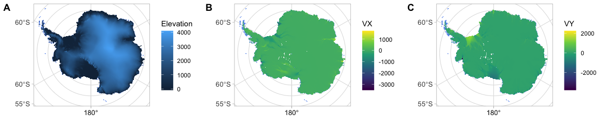
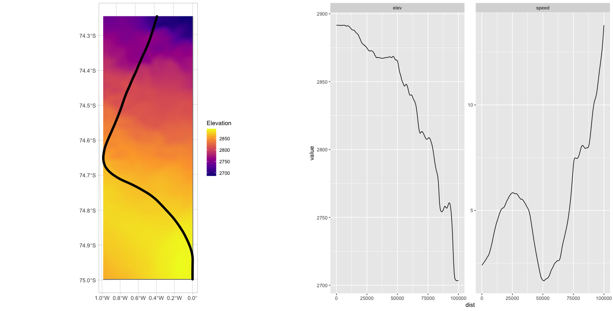

# topoExtract

The aim of topoExtract is to extract interpolated elevation values from a digital elevation model along a trajectory defined by ice-flow vectors.

## Datasets
### REMA Mosaic v1.1 200m (filled)

The Reference Elevation Model of Antarctica (REMA) is a high resolution, time-stamped Digital Surface Model (DSM) of Antarctica.
Downloaded from [here](https://data.pgc.umn.edu/elev/dem/setsm/REMA/mosaic/v1.1/200m/).

### MEaSUREs Phase-Based Antarctica Ice Velocity Map, Version 1 (450 m)
This data set, as part of the NASA Making Earth System Data Records for Use in Research Environments (MEaSUREs) Program, combines interferometric phases from multiple satellite interferometric synthetic-aperture radar systems to derive the first comprehensive phase-based map of Antarctic ice velocity. 
Downloaded from [here](https://n5eil01u.ecs.nsidc.org/MEASURES/NSIDC-0754.001/).

The downloaded dataset containts 10 variables in a netcdf format. I extracted vx and vz values and transferred them into a geotif for better and faster data handling with the R package `stars`.

``` r
library(raster)

nc_file <- stack(raster("antarctic_ice_vel_phase_map_v01.nc", varname = "VX"),
                 raster("antarctic_ice_vel_phase_map_v01.nc", varname = "VY")) %>% st_as_stars()

# plot(nc_file)
write_stars(nc_file, "antarctic_ice_vel_phase_map_v01.tif")
```

## Loading datasets as stars_proxy object

``` r
library(dplyr)

dm_proxy  <- read_stars("REMA_200m_dem_filled.tiff", proxy = T) %>%
                st_set_crs("+proj=stere +lat_0=-90 +lat_ts=-71 +lon_0=0 +x_0=0 +y_0=0 +datum=WGS84 +units=m +no_defs")
vel_proxy <- stars::read_stars("antarctic_ice_vel_phase_map_v01.tif", proxy = T)                 

  world <- rnaturalearth::ne_countries(scale = "medium", returnclass = "sf") %>%
    filter(name == "Antarctica")
  
  mp <- ggplot(data = world %>% st_transform(st_crs(dm_proxy))) +
    geom_sf(fill = NA, colour = NA) +
    geom_sf(fill = NA, colour = "cornflowerblue") +
    theme_light() +
    scale_x_continuous(name="") +
    scale_y_continuous(name="") +
    theme(axis.text = element_text(size = 10))
  
  pl1 <- mp +
          geom_stars(data = dm_proxy %>% setNames("Elevation"), 
             downsample = 35, na.action = na.omit)
  pl2 <- mp + 
          geom_stars(data = vel_proxy[,,,1] %>% setNames("VX"), 
            downsample = 35, na.action = na.omit) +
          scale_fill_continuous(type = "viridis")
  pl3 <-  mp + 
          geom_stars(data = vel_proxy[,,,2] %>% setNames("VY"), 
                     downsample = 35, na.action = na.omit) +
          scale_fill_continuous(type = "viridis")
  
  ggpubr::ggarrange(pl1, pl2, pl3, labels = c("A", "B", "C"),
                    ncol = 3, nrow = 1)
```

<center>

</img>

<figcaption>

Figure 1: The three datasets: A) Elevation, B) Ice velocity in x, C) Ice velocity in y.

</figcaption>

</center>

## `topoExtract` function

The `topoExtract` function needs the following input:

* p - starting position (matrix with 2 columns (x, y) and 1 row)
* dm_proxy - the elevation `stars_proxy` object
* vel_proxy - the ice velocity `stars_proxy` object
* traj_length_m - length of the trajectory in meters
* sampling_distance_m - sampling distance in meters

``` r
source("topoExtract.R")

start <- matrix(c(0, -75), ncol = 2, nrow = 1) ## Kohnen Station 

topo_traj <- topoExtract(start, dm_proxy, vel_proxy, 100*1000, 500)
```

The function provides a 'tibble' with coordinates (*lon*, *lat*), extracted elevation *elev*, the velocity values (*vx*, *vy*), the distance from the start in meter (*dist*), the direction from each point to the next in degrees (*dir*) and the *speed* of the ice-flow in m/yr. 

```r
library(ggplot2)

topo_traj_sf <- topo_traj %>% st_as_sf(coords = c("lon", "lat")) %>% 
                  st_set_crs(4326) %>% st_transform(st_crs(dm_proxy))

elev_sub <- dm_proxy %>% st_crop(st_bbox(topo_traj_sf) %>% st_as_sfc())

traj_pl <- ggplot(data = st_bbox(topo_traj_sf) %>% st_as_sfc()) +
    geom_sf(fill = NA, colour = NA) +
    geom_stars(data = elev_sub %>% setNames("Elevation")) + 
    scale_fill_viridis_c(option = "plasma") + 
    geom_sf(data = topo_traj_sf,
            mapping = aes(geometry = geometry), 
            shape = 19, size = 1.5) +
    theme_light() +
    scale_x_continuous(name="") +
    scale_y_continuous(name="") +
    theme(axis.text = element_text(size = 10))

extr_plot <- ggplot(topo_traj %>% dplyr::select(c("dist", "elev", "speed")) %>% tidyr::pivot_longer(cols = -dist),
         aes(x = dist, y = value)) + geom_line() +
              facet_wrap(vars(name), scales = "free_y")

ggpubr::ggarrange(traj_pl, extr_plot, ncol = 2, nrow = 1)
```

<center>

</img>

<figcaption>

Figure 2: Results of `topoExtract', with the simulated trajectory, the extracted elevation and speed of the ice-flow.

</figcaption>

</center>
